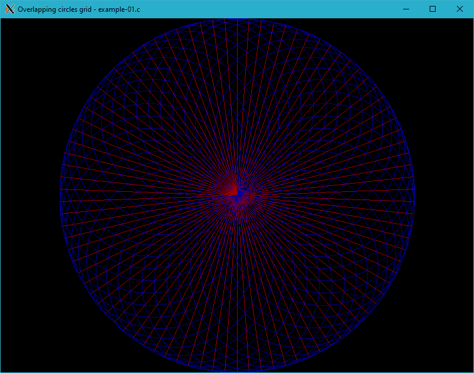

# example-01.c


/*
 * XWin library: Overlapping circles grid - example-01.c
 *
 * Copyright 2020-2021 Rafał Jopek ( rafaljopek at hotmail com )
 *
 * gcc example-01.c xwin.c -o example-01 -lX11
 *
 */

#include "xwin.h"

int main( int argc, char* argv[] )
{
   bool condition = true;
   int height = 0;
   int width = 0;
   int i, n;
   int y, x, radius = 150;
   int j, top, left;
   int key;

   if ( argc < 2 )
   {
      n = 45;
   }
   else
   {
      n = atoi( argv[ 1 ] );
   }

   XWinInit( argc, argv );

   XWinOpen( 800, 600, "Overlapping circles grid - example-01.c" );

   while( condition )
   {
      if( height != WindowHeight() || width != WindowWidth() )
      {
         height = WindowHeight();
         width = WindowWidth();

         Circle( height / 2, width / 2, radius * 2, 0x000099 );

         for( i = 0; i < n; i++ )
         {
            y = cos( M_PI + i * 2 * M_PI / n ) * radius + height / 2;
            x = sin(        i * 2 * M_PI / n ) * radius + width / 2;

            for( j = 0; j < 2; j++ )
            {
               top  = cos( M_PI + ( 2 * i + j ) * 2 * M_PI / ( n * 2 ) ) * radius * 2 + height / 2;
               left = sin(        ( 2 * i + j ) * 2 * M_PI / ( n * 2 ) ) * radius * 2 + width / 2;

               Line( top, left, height / 2, width / 2, 0x990000 );
            }
            Circle( y, x, radius, 0x000099 );
         }
      }

      key = XWinInkey();

      switch( key )
      {
      case XK_Escape:
         condition = false;
         break;
      }
   }

   XWinClose();

   return 0;
}



