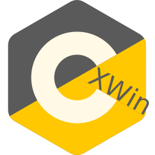
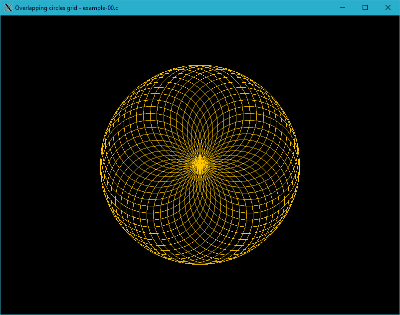

# XWin

**XWin** is a module providing bindings for the [libX11](https://www.x.org/ ) graphics library. This tutorial is intended for people who want to start to program with the libX11 library. Keep in mind that libX11, isn't what most programmers wanting to write graphic applications are looking for. They should use a much higher level GUI toolkit like [GTK](https://www.gtk.org/), [Motif](https://motif.ics.com/) etc. However, we need to start somewhere. More than this, knowing how things work down below is never a bad idea. The project has an educational nature the main goal is to expand knowledge in the field of creating the aplications with the usege of library libX11.

## Example code example-00.c


/*
 * -mwindows a Windows app is built which doesn't produce a console window.
 * gcc example-00.c xwin.c -o example-00 -lX11 -lm
 *
 */

#include "xwin.h"

int main( int argc, char* argv[] )
{
   bool condition = true;
   int height = 0;
   int width = 0;
   int y, x, i;
   int key;

   XWinInit( argc, argv );

   XWinOpen( 800, 600, "Example graphics program - example-00.c" );

   while( condition )
   {
      if( height != WindowHeight() || width != WindowWidth() )
      {
         height = WindowHeight();
         width  = WindowWidth();

         for( i = 1; i < 45; i++ )
         {
            y = cos( i ) * 100 + height / 2;
            x = sin( i ) * 100 + width / 2;
            Circle( y, x, 100, 0xffc800 );
         }
      }

      key = XWinInkey();

      switch( key )
      {
      case XK_Escape:
         condition = false;
         break;
      }
   }

   XWinClose();

   return 0;
}


## License

> &copy; 2020-2021 Rafał Jopek
